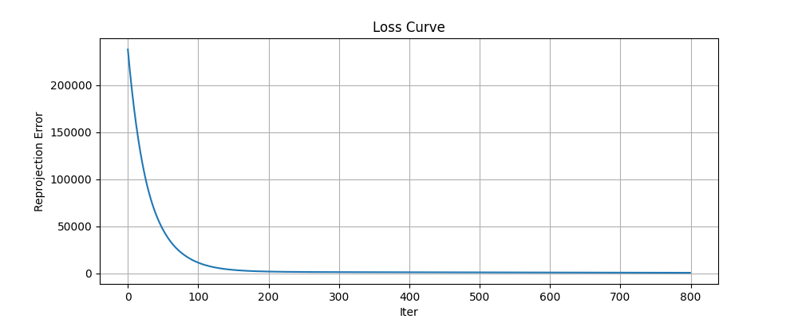

# 3D Head Reconstruction via Bundle Adjustment

This repository is the official implementation of **3D Head Reconstruction via Bundle Adjustment**.

📌 本项目从多视角 2D 观测出发，通过优化恢复：

* 3D 点云结构（20000 points）
* 相机外参（50 views）
* 相机内参（共享焦距）

<p align="center">
  
</p>

---

# Requirements

To install requirements:

```bash
pip install -r requirements.txt
```

📋 环境配置说明：

推荐使用 Conda：

```bash
conda create -n ba python=3.9
conda activate ba
pip install torch numpy matplotlib tqdm
```

📦 数据准备：

将以下文件放在项目根目录：

```
points2d.npz
points3d_colors.npy
```

---

# Training (Optimization)

To run Bundle Adjustment optimization:

```bash
python bundle.py
```

📋 训练（优化）说明：

本项目不涉及传统深度学习训练，而是基于 **可微优化（Bundle Adjustment）**：

### 优化变量：

* 3D 点：`(20000, 3)`
* 相机旋转（Euler）：`(50, 3)`
* 相机平移：`(50, 3)`
* 焦距：`f`

### 投影模型：

$$
u = -f \cdot \frac{X_c}{Z_c} + c_x,\quad
v = f \cdot \frac{Y_c}{Z_c} + c_y
$$

其中：

$$
[X_c, Y_c, Z_c] = R \cdot X + T
$$

### 损失函数：

* 重投影误差（Huber Loss）
* 可见性 mask 加权

### 超参数：

```bash
iterations = 800
lr = 1e-3
init focal ≈ 700
init translation = [0, 0, -2.5]
```

---

# Evaluation

To evaluate reconstruction quality:

```bash
python bundle.py
```

📋 评估方式：

由于无 GT 3D，本项目采用：

* 📉 重投影误差（Reprojection Loss）
* 👁️ 可视化结果（OBJ 点云）

输出文件：

```
result.obj
```

---

# Pre-trained Models

本项目为优化问题，不涉及预训练模型。

但可以直接使用：

* 输入：`points2d.npz`
* 输出：优化后的 3D 结构

---

# Results

## 📊 Optimization Performance

| Iteration | Loss    |
| --------- | ------- |
| 0         | 238034  |
| 100       | 11201   |
| 300       | 1147    |
| 500       | 923     |
| 800       | **566** |

最终焦距：

```
f ≈ 700
```

---

## 🧠 Reconstruction Result

生成点云：

```
result.obj
```

可用以下软件查看：

* MeshLab（推荐）
* Blender
* CloudCompare

---

# Visualization

Loss 曲线：

```bash
python bundle.py
```

将自动绘制优化过程：

📉 Loss 持续下降，说明 BA 收敛良好


<video src="3_1.mp4" controls width="800" alt="视频演示"></video>

---
---

# Key Features

✅ 无需 PyTorch3D
✅ 支持 Euler 角旋转
✅ 数值稳定（Z clamp + log focal）
✅ 支持 visibility mask
✅ 输出彩色点云

---

# Project Structure

```
.
├── bundle.py
├── points2d.npz
├── points3d_colors.npy
├── reconstructed_head.obj
└── README.md
```

---

