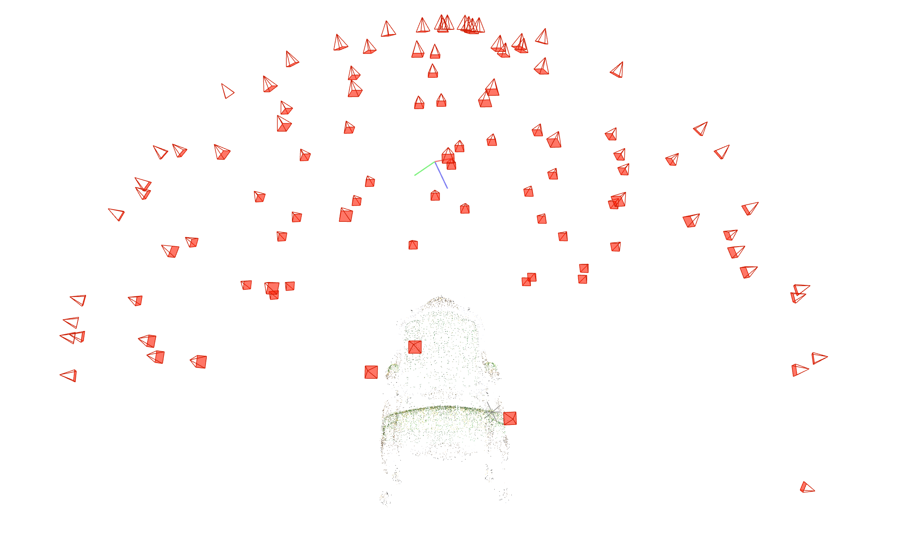

这是一个为您准备的 Markdown 格式实验报告模板。我已将作业要求中的关键点转化为报告结构，并用特定的标记（如 `[]`）标出了需要您填入具体实验结果和数据的地方。

***

# 简化版 3D 高斯喷溅 (3DGS) 实验报告

---

## 1. 引言
本实验基于 PyTorch 框架实现了一个简化版的 3D 高斯喷溅（3D Gaussian Splatting, 3DGS）模型。我们将复现从多视图图像重建 3D 场景的完整流水线，包括利用 COLMAP 进行相机姿态估计与稀疏点云初始化，以及通过可微分的高斯光栅化（α-blending）进行场景优化。实验还将对比官方实现的性能差异，并分析简化版模型的优缺点。

---

## 2. 实验环境与数据集

### 2.1 环境配置
*   **操作系统：** [例如：Windows]
*   **Python 版本：** [例如：3.8.18]
*   **PyTorch 版本：** [例如：2.0.1]
*   **GPU 型号及显存：** [例如：NVIDIA GeForce RTX 4060]

### 2.2 数据集
本实验选取了chair场景进行实验。该数据集包含约 100 张多视角渲染图像
---

## 3. 实验过程与结果 (Task 1 & Task 2)

### 3.1 任务一：COLMAP 运动结构恢复
使用 COLMAP 对输入图像进行稀疏重建，以获取相机的内外参和初始的 3D 点云。

**执行命令：**
bash
python mvs_with_colmap.py --data_dir data/chair
python debug_mvs_by_projecting_pts.py --data_dir data/chair

**结果展示：**
*   **稀疏点云可视化：**
    *(此处请插入 COLMAP 生成的稀疏点云截图)*

*   **重投影验证：**
    *(此处请插入重投影验证的截图，展示 3D 点是否正确投影回图像对应位置)*
    ![填入图片路径]

**分析：**
通过 COLMAP 成功恢复了 [X] 个相机位姿和 [Y] 个稀疏 3D 点。重投影验证结果表明，初始的稀疏点云分布合理，能够大致勾勒出场景的几何结构，为后续的高斯初始化提供了可靠的初始位置 $\mu$。

### 3.2 任务二：简化版 3D 高斯喷溅实现

#### 3.2.1 三维高斯初始化 (Task 2.1)
参考论文公式 (6)，利用 COLMAP 输出的 3D 点位置 $\mu$ 作为高斯中心。随机初始化旋转四元数 $R$、缩放矩阵 $S$、不透明度 $o$ 和颜色 $c$。

**待完成代码 (gaussian_model.py#L103)：**
*在此处简述您的实现逻辑，例如：*
> 根据给定的缩放向量 `scale` 和单位四元数 `quaternion`，首先将其转换为旋转矩阵 $R$，然后计算协方差矩阵 $\Sigma = R S S^T R^T$。为了确保矩阵正定性，添加了微小的抖动项 $\epsilon I$。

#### 3.2.2 3D 高斯投影至 2D (Task 2.2)
参考论文公式 (5)，将 3D 高斯投影到图像平面上。
$$ \Sigma' = J W \Sigma W^T J^T $$
其中 $W$ 为世界到相机的变换矩阵，$J$ 为投影变换的雅可比矩阵。

**待完成代码 (gaussian_renderer.py#L26)：**
> 实现了从相机坐标系到图像坐标系的仿射变换，并计算了投影后的 2D 协方差矩阵 $\Sigma'$。处理了透视投影带来的非线性畸变。

#### 3.2.3 计算二维高斯值 (Task 2.3)
根据公式计算 2D 高斯在像素 $x$ 处的取值：
$$ f(x; \mu_i, \Sigma_i) = \frac{1}{2\pi\sqrt{|\Sigma_i|}} \exp\left(-\frac{1}{2}(x - \mu_i)^T \Sigma_i^{-1} (x - \mu_i)\right) $$

**待完成代码 (gaussian_renderer.py#L61)：**
> 利用 PyTorch 的 `torch.cholesky` 或 `torch.linalg.inv` 求解高斯的行列式和逆矩阵，计算了每个高斯对屏幕空间的贡献值。

#### 3.2.4 α 混合与体积渲染 (Task 2.4)
给定按深度排序的 2D 高斯，通过 α-blending 计算最终像素颜色：
$$ C = \sum_{i=1}^N T_i \alpha_i c_i, \quad T_i = \prod_{j=1}^{i-1} (1 - \alpha_j) $$

**待完成代码 (gaussian_renderer.py#L83)：**
> 实现了基于排序的深度优先渲染。首先计算每个高斯的 alpha 值 ($\alpha = o \cdot f(x)$)，然后从后向前（或从近到远）进行累积乘积和加权求和，输出最终的 RGB 值和深度图。

### 3.3 训练过程与视觉效果
启动训练脚本，观察模型从初始稀疏点云逐渐 densify 并拟合场景的过程。

**执行命令：**
bash
python train.py --colmap_dir data/chair --checkpoint_dir data/chair/checkpoints

**结果展示：**
*   **训练过程中的中间渲染图 (Checkpoint 000020)：**
    *(此处插入训练中期的截图)*
    ![填入图片路径]
*   **最终训练结果 (Checkpoint 000060)：**
    *(此处插入训练结束后的高质量渲染图，建议选择一个原图中未出现的视角)*
    ![填入图片路径]
*   **与原图对比：**
    *(此处插入一张原输入图像与生成的新视角图像并排对比)*
    ![填入图片路径]

**分析：**
经过 60,000 次迭代训练，模型成功生成了具有丰富细节的 3D 高斯集合。与初始的稀疏点云相比，模型不仅恢复了物体的宏观结构，还很好地还原了 [例如：椅子的纹理/乐高的边缘]。渲染出的新视角图像在视觉上具有高度的保真度。

---

## 4. 官方 3DGS 对比分析 (Task 3)

为了评估简化版模型的性能，我们使用相同的数据集和超参数（尽可能保持一致）运行了官方 3DGS 实现。

### 4.1 实验设置
*   **官方代码版本：** [填写官方仓库的 commit hash 或版本号]
*   **对比指标：** 渲染质量 (PSNR/SSIM/LPIPS)、训练收敛速度 (时间/迭代次数)、显存占用 (GPU Memory)。

### 4.2 结果对比

| 指标 | 本作业 (简化版 3DGS) | 官方 3DGS | 差异分析 |
| :--- | :--- | :--- | :--- |
| **渲染质量 (PSNR)** | [填入您的 PSNR 数值] dB | [填入官方 PSNR 数值] dB | [分析差异原因，例如：由于缺乏 adaptive densification，细节恢复可能不足] |
| **训练时间** | [填入训练总耗时，例如：2小时] | [填入官方耗时，例如：20分钟] | **差异显著**。官方实现使用了 CUDA 内核加速 (tile-based rasterizer)，而纯 PyTorch 实现在 Python 解释器和通用矩阵运算上开销较大。 |
| **显存占用 (GPU Mem)** | [填入显存峰值，例如：18 GB] | [填入官方显存，例如：6 GB] | **差异显著**。简化版未进行显存优化（如半精度浮点数 fp16 优化、紧凑的张量存储等）。 |

### 4.3 差异来源讨论
1.  **渲染效率 (Tile-based Rasterizer vs. Naive PyTorch)：**
    本实验采用的是朴素的 PyTorch 逐像素/逐高斯计算，计算复杂度较高。官方实现编写了定制的 CUDA 内核，采用了基于 Tile 的光栅化策略，大幅减少了无效的高斯求交计算，因此速度提升了数十倍。
2.  **自适应致密化 (Adaptive Densification)：**
    本简化版模型移除了论文中的自适应致密化模块。这意味着在场景表面曲率大或颜色变化剧烈的区域（如锐利的边缘），模型无法通过分裂或克隆高斯来补充细节，只能通过初始的缩放和平滑约束来逼近，这可能导致某些区域的渲染结果略显模糊或出现伪影。
3.  **代码优化与工程细节：**
    官方代码在损失函数计算、梯度回传、数据结构设计（如使用 Plücker 坐标存储光线等）上经过了高度优化。纯 PyTorch 实现在这些底层细节上的缺失导致了显存和计算资源的浪费。

---

## 5. 结论
本实验成功实现了一个简化版的 3D 高斯喷溅模型，完整跑通了从稀疏重建到可微分渲染的 pipeline。虽然由于缺乏底层优化（如 CUDA 加速）和关键模块（如自适应致密化），简化版模型在训练速度和显存占用上不及官方实现，但其渲染质量依然令人满意，证明了 3DGS 算法核心思想（即用 3D 高斯表示场景并进行 α-blending）的有效性和鲁棒性。

通过本次实验，深入理解了 3D 高斯参数化、投影变换以及可微分体渲染的物理意义，为后续研究或更高效的 3D 重建算法打下了基础。

---

## 附录：关键代码片段 (可选)
*(如果您认为有必要，可以在此处粘贴您认为最重要的几个函数的代码，例如 `compute_covariance` 或 `render` 函数)*

python
# 示例：gaussian_renderer.py 中的渲染核心代码
def render(gaussians, camera):
    # 1. 投影
    projected_gaussians = project_to_2d(gaussians, camera)
    # 2. 计算高斯值
    values = compute_gaussian_values(projected_gaussians, camera.pixels)
    # 3. 排序与混合
    sorted_indices = sort_by_depth(values)
    colors = alpha_blending(values, sorted_indices)
    return colors

***
*提示：请将所有 `[ ]` 中的占位符替换为您的实际实验数据和截图路径。*
